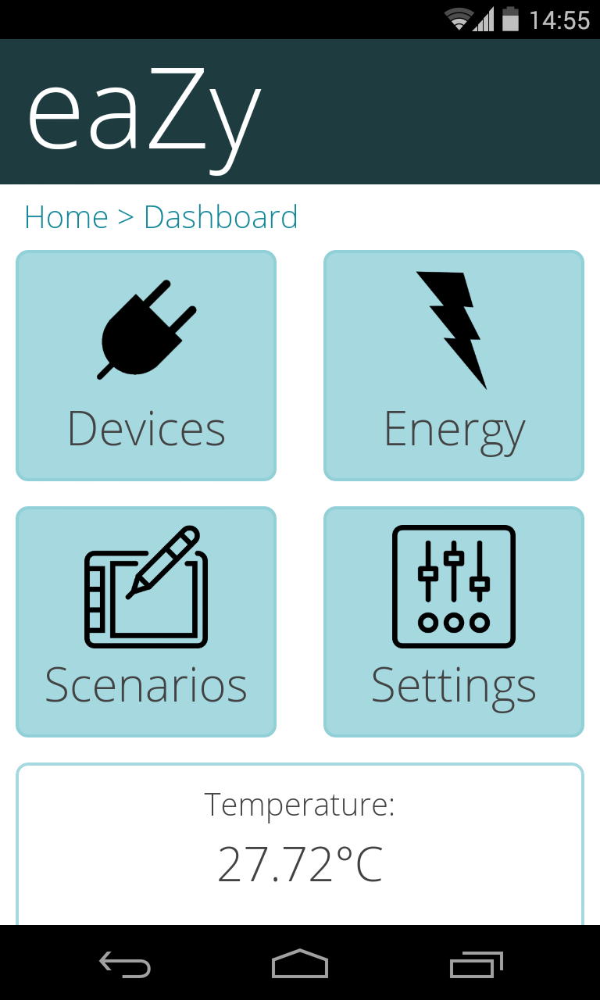
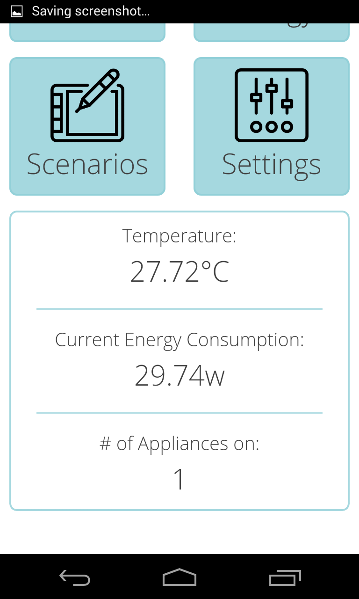
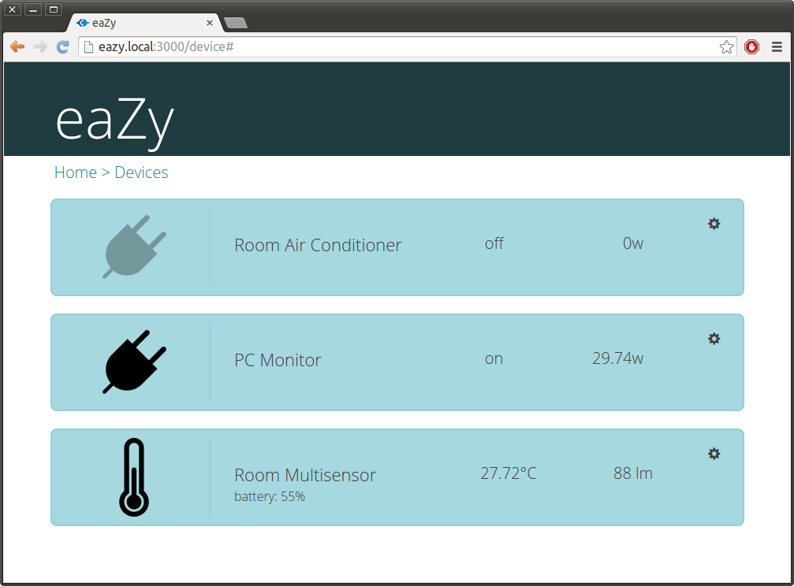
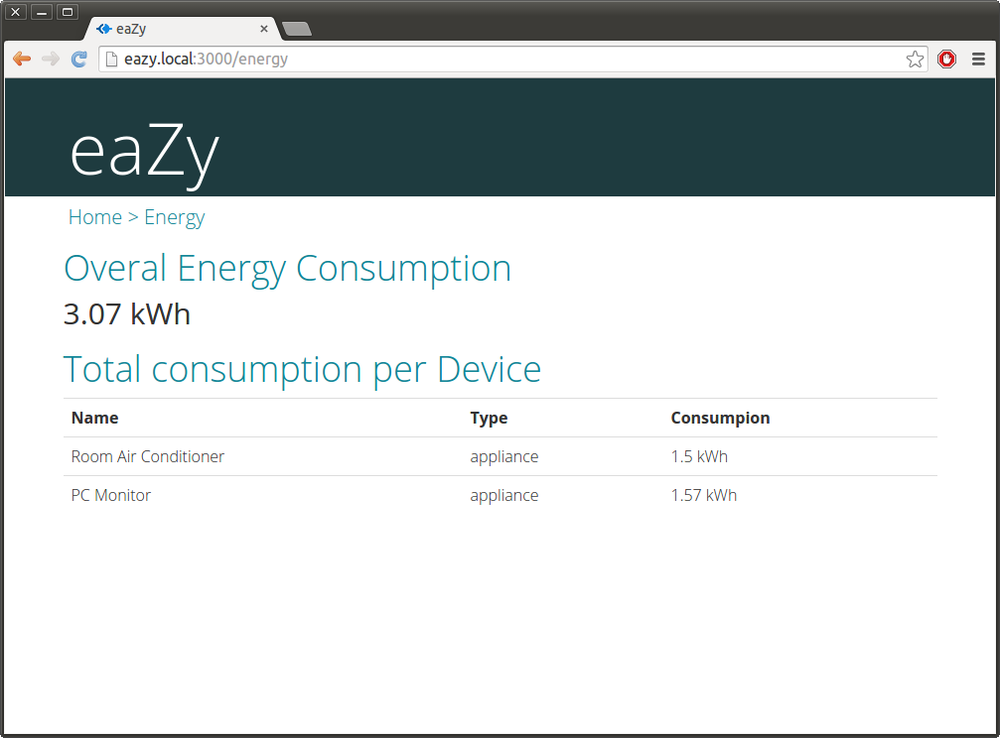
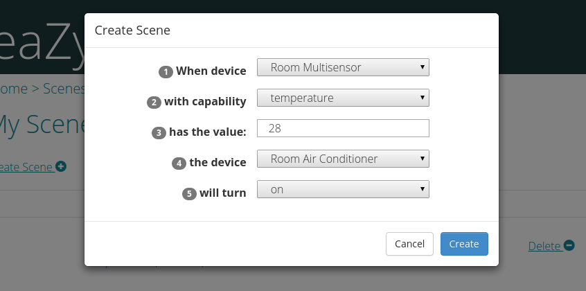

<b>eaZy</b> is a Home Automation project that proposes easyness on installation and
configuration by using ZWave devices and a simple Web interface.

<b>Note</b>: eaZy is an early stage project.

## Features
Control of ZWave devices by using a simple web interface.

## What you will need
- <b>ZWave Devices</b>: The system communicates with ZWave devices by using a ZWave USB Controller (such as the ZStick 2).
- <b>Host</b>: Any hardware supporting a debian-like linux distribution may work, though only a Desktop and Raspberry Pi have been tested until now. It is recommended Ubuntu or Raspbian, which used during development.
- <b>Software</b>: Currently, there is no automatic installer. Though, the installation is not a big issue: just follow the `scripts/install_dependencies.sh` file.
- <b>Connection</b>: The host needs to be connected to the local network so it can be accessed. Example: `http://raspberrpi.local:3000` or `http://<host-ip>:3000`.

## Support
If you have any problems or questions, feel free to open a new issue, or email me at hoffmann.matheus <at> gmail.

## License
The MIT License (MIT)

Copyright (c) 2014 Matheus Hoffmann Silva.

Permission is hereby granted, free of charge, to any person obtaining a copy of
this software and associated documentation files (the "Software"), to deal in
the Software without restriction, including without limitation the rights to
use, copy, modify, merge, publish, distribute, sublicense, and/or sell copies of
the Software, and to permit persons to whom the Software is furnished to do so,
subject to the following conditions:

The above copyright notice and this permission notice shall be included in all
copies or substantial portions of the Software.

THE SOFTWARE IS PROVIDED "AS IS", WITHOUT WARRANTY OF ANY KIND, EXPRESS OR
IMPLIED, INCLUDING BUT NOT LIMITED TO THE WARRANTIES OF MERCHANTABILITY, FITNESS
FOR A PARTICULAR PURPOSE AND NONINFRINGEMENT. IN NO EVENT SHALL THE AUTHORS OR
COPYRIGHT HOLDERS BE LIABLE FOR ANY CLAIM, DAMAGES OR OTHER LIABILITY, WHETHER
IN AN ACTION OF CONTRACT, TORT OR OTHERWISE, ARISING FROM, OUT OF OR IN
CONNECTION WITH THE SOFTWARE OR THE USE OR OTHER DEALINGS IN THE SOFTWARE.
